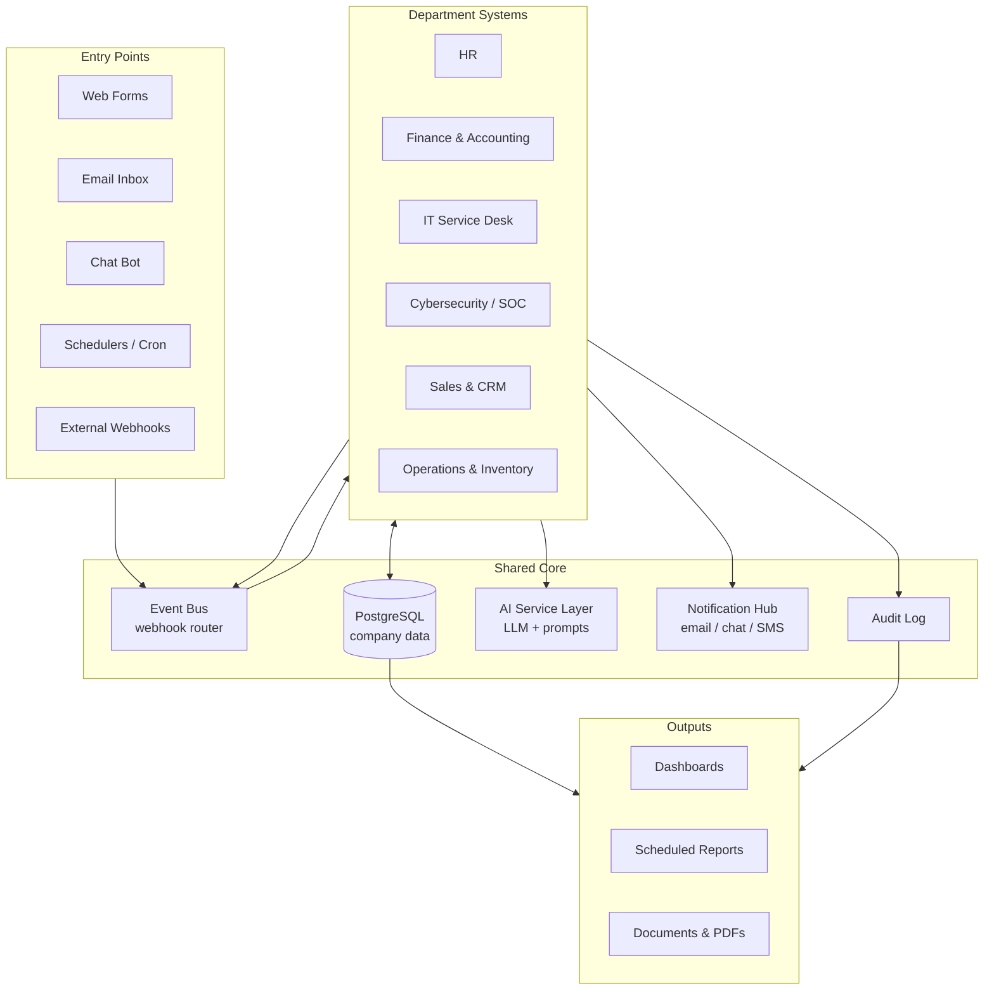

# CompanyFlow

**A complete, automated company operating system built entirely on [n8n](https://n8n.io).**

CompanyFlow models a real company as a set of connected department systems — HR, Finance, IT, Cybersecurity, Sales and Marketing — where each department is a collection of n8n workflows that talk to each other through a shared event bus, a shared database and a shared AI layer.

> DEPI (Digital Egypt Pioneers) — AI & Automation using n8n — Graduation Project, 2026.


---

## Table of Contents

- [Overview](#overview)
- [Problem Statement](#problem-statement)
- [Architecture](#architecture)
- [Department Modules](#department-modules)
- [Shared Core Services](#shared-core-services)
- [Tech Stack](#tech-stack)
- [Repository Structure](#repository-structure)
- [Getting Started](#getting-started)
- [Environment Variables](#environment-variables)
- [Importing & Exporting Workflows](#importing--exporting-workflows)
- [Workflow Conventions](#workflow-conventions)
- [Demo Scenarios](#demo-scenarios)
- [Roadmap](#roadmap)
- [Team](#team)
- [Contributing](#contributing)
- [License](#license)

---

## Overview

Most small and medium companies run on a pile of disconnected tools: a spreadsheet for leave requests, an inbox for invoices, a WhatsApp group for IT problems, and nothing at all for security monitoring. Work gets lost between the gaps.

CompanyFlow replaces that pile with one automated backbone. Every department is automated as an independent n8n system with its own triggers, data and approvals — but all of them publish and consume events on a shared bus, so an action in one department automatically drives the right actions in the others.

Hire someone in HR, and the system creates their payroll record, opens their IT accounts, assigns their laptop, enrolls them in security awareness training and sends them a day-one welcome pack. No human copies data between systems.

**Key characteristics**

- **Low-code, not no-code** — logic lives in n8n workflows, with small JavaScript Code nodes where expression syntax is not enough.
- **Event-driven** — departments are decoupled; they communicate through webhook events, not direct calls.
- **AI-assisted** — an LLM layer handles classification, summarization, drafting and triage instead of rigid keyword rules.
- **Human-in-the-loop** — anything with money, access or risk attached stops for an approval step.
- **Auditable** — every automated decision writes a row to the audit log with its inputs, outputs and the workflow that produced it.

---

## Problem Statement

| Pain point | Manual reality | CompanyFlow |
|---|---|---|
| Employee onboarding | 6–8 people notified by email over several days | One form submission, all departments triggered in seconds |
| Invoice handling | Attachments read and retyped by hand | AI extraction → validation → approval → ledger entry |
| IT support | Requests lost in chat groups | Ticket created, classified, prioritized and routed automatically |
| Security alerts | Nobody watching logs | Alerts enriched, scored and escalated on a schedule |
| Reporting | Someone builds slides at month end | Scheduled reports generated and delivered automatically |

---

## Architecture



**How the event bus works**

1. A department workflow finishes a unit of work and POSTs an event to the bus webhook:
   ```json
   {
     "event": "hr.employee.hired",
     "source": "hr",
     "timestamp": "2026-09-19T10:04:00Z",
     "payload": { "employee_id": "EMP-1042", "department": "Engineering", "start_date": "2026-10-01" }
   }
   ```
2. The bus writes the event to the audit log and looks up its subscriber table.
3. Every subscribed department workflow is called with the same payload, in parallel.
4. Each subscriber is idempotent — replaying an event does not duplicate its effect.

This is what keeps the project buildable by a team: each member owns one department and only has to agree on event names, not on internals.

---

## Department Modules

### HR System

| Workflow | Trigger | What it does |
|---|---|---|
| `hr-onboarding` | Form submission | Creates employee record, emits `hr.employee.hired`, generates contract PDF, sends welcome pack |
| `hr-leave-request` | Form / chat | Checks balance, routes to manager approval, updates calendar, notifies payroll |
| `hr-attendance-sync` | Schedule (daily) | Pulls check-in data, flags anomalies, builds monthly summary |
| `hr-offboarding` | Form submission | Emits `hr.employee.left`, triggers access revocation and asset return |
| `hr-cv-screening` | Email / webhook | AI parses CVs against the job description, scores and shortlists candidates |

### Finance & Accounting System

| Workflow | Trigger | What it does |
|---|---|---|
| `fin-invoice-intake` | Email attachment | AI extracts vendor, amount, dates and line items; validates against PO |
| `fin-approval-chain` | Event | Routes by amount threshold to the right approver; escalates on timeout |
| `fin-payroll-run` | Schedule (monthly) | Builds payroll from HR attendance and leave data, generates payslip PDFs |
| `fin-expense-claims` | Form submission | Policy check, receipt OCR, approval, reimbursement record |
| `fin-monthly-report` | Schedule | Revenue, expense and cash-flow summary delivered to management |

### IT Service Desk

| Workflow | Trigger | What it does |
|---|---|---|
| `it-ticket-intake` | Email / form / chat | Creates ticket, AI classifies category and priority, assigns owner |
| `it-account-provisioning` | Event `hr.employee.hired` | Creates accounts, mailbox and group memberships; returns credentials securely |
| `it-access-revocation` | Event `hr.employee.left` | Disables accounts, revokes tokens, archives mailbox |
| `it-asset-tracking` | Event / form | Assigns and returns hardware, keeps the asset register current |
| `it-sla-monitor` | Schedule (hourly) | Escalates tickets approaching SLA breach |

### Cybersecurity / SOC System

| Workflow | Trigger | What it does |
|---|---|---|
| `sec-alert-ingest` | Webhook | Normalizes alerts from monitoring sources into a single schema |
| `sec-ioc-enrichment` | Event | Enriches IPs, domains and hashes with threat-intel reputation |
| `sec-triage-ai` | Event | AI summarizes the alert, scores severity, proposes containment actions |
| `sec-incident-response` | Event | Opens an incident record, notifies the on-call, tracks containment steps |
| `sec-phishing-report` | Email forward | Analyzes the reported message, extracts indicators, warns all staff if malicious |
| `sec-awareness-training` | Event `hr.employee.hired` | Enrolls new joiners in awareness training and tracks completion |

### Sales & CRM System

| Workflow | Trigger | What it does |
|---|---|---|
| `crm-lead-capture` | Web form / webhook | Deduplicates, scores and assigns leads to sales owners |
| `crm-followup-sequence` | Schedule | Sends staged follow-ups; stops automatically on reply |
| `crm-quote-generation` | Form / chat | Generates a quotation PDF from a product catalog and sends it for approval |
| `crm-deal-to-invoice` | Event `crm.deal.won` | Hands the deal to Finance and to Operations for fulfilment |

### Operations & Inventory

| Workflow | Trigger | What it does |
|---|---|---|
| `ops-stock-monitor` | Schedule | Watches stock levels and raises reorder requests below threshold |
| `ops-purchase-order` | Event | Builds the PO, routes it for approval, notifies the vendor |
| `ops-delivery-tracking` | Webhook | Updates order status and notifies the customer at each stage |
| `ops-kpi-dashboard` | Schedule | Aggregates operational KPIs for the management dashboard |

---

## Shared Core Services

| Service | Implementation | Purpose |
|---|---|---|
| **Event Bus** | `core-event-bus` workflow + `events` / `subscriptions` tables | Publish/subscribe routing between departments |
| **Data Layer** | PostgreSQL | Single source of truth for employees, tickets, invoices, assets, incidents |
| **AI Layer** | `core-ai-gateway` sub-workflow | One entry point for all LLM calls; centralizes prompts, model choice, retries and cost logging |
| **Notification Hub** | `core-notify` sub-workflow | One interface for email, chat and SMS so departments never talk to channels directly |
| **Audit Log** | `audit_log` table | Every automated decision: workflow, execution id, inputs, output, actor, timestamp |
| **Error Handler** | n8n Error Trigger workflow | Catches failed executions, alerts the owner, records the failure |

---

## Tech Stack

| Layer | Technology |
|---|---|
| Automation engine | n8n (self-hosted, queue mode optional) |
| Database | PostgreSQL 16 |
| Cache / queue | Redis (for n8n queue mode) |
| AI | Gemini / OpenAI-compatible REST endpoints via the AI gateway |
| Documents | PDF generation nodes and HTML templates |
| Messaging | SMTP email, Telegram / Slack bot |
| Deployment | Docker Compose, reverse proxy with HTTPS |
| Version control | Git — workflows exported as JSON |

---

## Repository Structure

```
CompanyFlow/
├── docker/
│   ├── docker-compose.yml
│   └── .env.example
├── workflows/
│   ├── core/                 # event bus, AI gateway, notifications, error handler
│   ├── hr/
│   ├── finance/
│   ├── it/
│   ├── security/
│   ├── sales/
│   └── operations/
├── database/
│   ├── schema.sql            # tables, indexes, constraints
│   └── seed.sql              # demo data for the presentation
├── docs/
│   ├── architecture.md
│   ├── event-catalog.md      # every event name, payload schema and subscriber
│   ├── setup-guide.md
│   └── screenshots/
├── prompts/                  # LLM prompt templates used by the AI gateway
└── README.md
```

---

## Getting Started

### Prerequisites

- Docker and Docker Compose
- 4 GB RAM free
- API keys for the LLM provider and any external services you enable

### 1. Clone and configure

```bash
git clone https://github.com/<your-username>/CompanyFlow.git
cd CompanyFlow/docker
cp .env.example .env
```

Open `.env` and fill in the values listed in [Environment Variables](#environment-variables). Generate a strong encryption key — if you lose it, all stored credentials become unreadable:

```bash
openssl rand -hex 32
```

### 2. Start the stack

```bash
docker compose up -d
```

n8n will be available at `http://localhost:5678`. Create the owner account on first launch.

### 3. Load the database schema

```bash
docker compose exec -T postgres psql -U companyflow -d companyflow < ../database/schema.sql
docker compose exec -T postgres psql -U companyflow -d companyflow < ../database/seed.sql
```

### 4. Import the workflows

```bash
docker compose exec n8n n8n import:workflow --separate --input=/data/workflows
```

### 5. Create credentials in n8n

Workflows reference credentials **by name**, so create them with exactly these names in *Settings → Credentials*:

| Credential name | Type |
|---|---|
| `CompanyFlow Postgres` | Postgres |
| `CompanyFlow SMTP` | SMTP |
| `CompanyFlow LLM` | HTTP Header Auth |
| `CompanyFlow Chat Bot` | Telegram / Slack |

### 6. Activate

Activate the `core/` workflows first, then the department workflows. Run `demo/seed-events.http` (or the demo scenarios below) to verify everything is wired correctly.

---

## Environment Variables

| Variable | Description | Example |
|---|---|---|
| `N8N_ENCRYPTION_KEY` | Encrypts stored credentials — back this up | `a3f1…` |
| `N8N_HOST` | Public hostname | `companyflow.example.com` |
| `WEBHOOK_URL` | Base URL used to build webhook addresses | `https://companyflow.example.com/` |
| `GENERIC_TIMEZONE` | Timezone for Schedule triggers | `Africa/Cairo` |
| `DB_TYPE` | n8n database type | `postgresdb` |
| `DB_POSTGRESDB_HOST` | Database host | `postgres` |
| `DB_POSTGRESDB_DATABASE` | Database name | `companyflow` |
| `DB_POSTGRESDB_USER` | Database user | `companyflow` |
| `DB_POSTGRESDB_PASSWORD` | Database password | *(secret)* |
| `EXECUTIONS_DATA_PRUNE` | Prune old execution data | `true` |
| `EXECUTIONS_DATA_MAX_AGE` | Hours to retain executions | `336` |

> **Never commit `.env` or exported credentials.** `.gitignore` already excludes them. Workflow JSON is exported without credential secrets — only credential *names* are stored.

---

## Importing & Exporting Workflows

Workflows are the source code of this project, so they are versioned as JSON.

**Export everything after making changes:**

```bash
docker compose exec n8n n8n export:workflow --all --separate --output=/data/workflows
```

**Export a single workflow:**

```bash
docker compose exec n8n n8n export:workflow --id=42 --output=/data/workflows/hr/hr-onboarding.json
```

**Re-import after pulling changes:**

```bash
docker compose exec n8n n8n import:workflow --separate --input=/data/workflows
```

Commit the exported JSON with a message describing the behavior change, not the node change.

---

## Workflow Conventions

These rules keep six people's work mergeable:

- **Naming** — `<dept>-<action>` in kebab-case: `hr-leave-request`, `sec-alert-ingest`.
- **Events** — `<domain>.<entity>.<past-tense-verb>`: `hr.employee.hired`, `fin.invoice.approved`. Every new event must be documented in `docs/event-catalog.md` before it is published.
- **Sub-workflows** — shared logic lives in `core/` and is called with *Execute Workflow*. Departments never duplicate notification or AI logic.
- **Idempotency** — every consumer checks for an existing record before creating one; events may be delivered more than once.
- **Error handling** — every production workflow sets an Error Workflow in its settings.
- **Secrets** — no keys, tokens, emails or real personal data inside nodes. Use credentials and environment variables.
- **Documentation** — add a Sticky Note at the top of each workflow: purpose, trigger, inputs, outputs, owner.

---

## Demo Scenarios

Scripted end-to-end flows used in the project defense:

1. **New hire, zero manual steps** — submit the onboarding form and watch HR, Finance, IT and Security all react to one event.
2. **Invoice to payment** — email an invoice PDF; AI extracts the data, validation runs, approval is requested, the ledger is updated.
3. **Phishing report** — a user forwards a suspicious email; it is analyzed, indicators extracted, an incident opened, and staff warned.
4. **Lead to cash** — a web lead is scored and assigned, a quote is generated, the deal is won, and Finance and Operations pick it up automatically.
5. **Employee exit** — one offboarding form revokes every account, reclaims assets and closes payroll.

---

## Roadmap

- [x] Architecture and event catalog
- [x] Core services: event bus, AI gateway, notifications, audit log
- [ ] Six department modules complete
- [ ] Management dashboard
- [ ] Role-based approval matrix
- [ ] Arabic language support in AI responses and notifications
- [ ] Automated tests for critical workflows
- [ ] Deployment guide for a production VPS

---

## Team

DEPI — AI & Automation using n8n — Cohort `CAI5_AIS9_S3`

| Member | Role | Module |
|---|---|---|
| Abdalrahman Atef (Park) | Team lead / architecture | Core services + Cybersecurity |
| *(name)* | Developer | HR |
| *(name)* | Developer | Finance & Accounting |
| *(name)* | Developer | IT Service Desk |
| *(name)* | Developer | Sales & CRM |
| *(name)* | Developer | Operations & Inventory |

Supervisor: *(name)*

---

## Contributing

1. Create a branch per module: `feature/hr-leave-request`.
2. Build and test the workflow in your local n8n instance.
3. Export it to the right folder under `workflows/`.
4. Update `docs/event-catalog.md` if you added or changed an event.
5. Open a pull request describing the behavior, the events consumed and the events published.

---

## License

Released under the MIT License. See [LICENSE](LICENSE).

---

## Acknowledgments

Built as the graduation project for the **Digital Egypt Pioneers Initiative (DEPI)**, Ministry of Communications and Information Technology — AI & Automation using n8n track.
