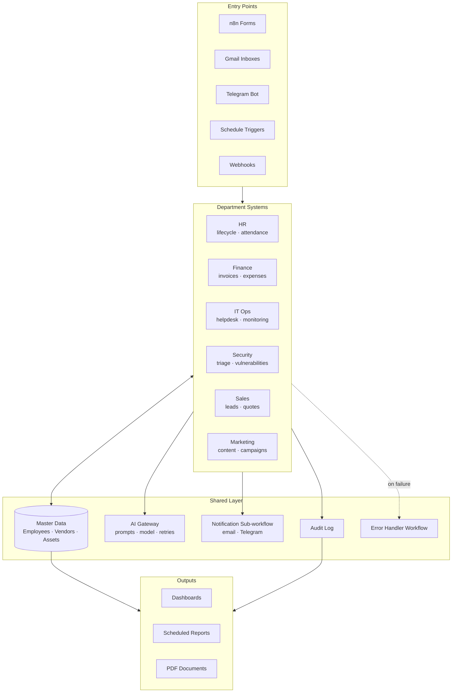

# CompanyFlow

**A complete automated company system built entirely on [n8n](https://n8n.io).**

CompanyFlow automates six departments of a company — HR, Accounting & Finance, IT Operations, Cybersecurity, Sales & CRM and Marketing — as twelve independent n8n systems that share one master data layer and one set of conventions.

> DEPI (Digital Egypt Pioneers Initiative) — AI & Automation track — Graduation Project, 2026.


---

## Table of Contents

- [Overview](#overview)
- [Team & Ownership](#team--ownership)
- [The Twelve Systems](#the-twelve-systems)
  - [HR](#hr)
  - [Accounting & Finance](#accounting--finance)
  - [IT Operations](#it-operations)
  - [Cybersecurity](#cybersecurity)
  - [Sales & CRM](#sales--crm)
  - [Marketing](#marketing)
- [Architecture](#architecture)
- [Optional Cross-System Integrations](#optional-cross-system-integrations)
- [Tech Stack](#tech-stack)
- [Repository Structure](#repository-structure)
- [Getting Started](#getting-started)
- [Workflow Conventions](#workflow-conventions)
- [Demo Scenarios](#demo-scenarios)
- [Roadmap](#roadmap)
- [Contributing](#contributing)
- [License](#license)

---

## Overview

Small and medium companies run on disconnected tools: a spreadsheet for leave, an inbox for invoices, a chat group for IT problems, and nothing at all watching for security issues. Work falls into the gaps between them.

CompanyFlow replaces that with twelve automated systems, two per department, each built as a set of n8n workflows. Every system works standalone — it has its own triggers, its own data and its own approvals — but all twelve follow the same naming, logging and master-data rules, so they can be connected without rewriting anything.

**Design principles**

- **Standalone first** — each system is complete on its own. Cross-system links are additions, never dependencies.
- **AI where rules fail** — LLMs handle CV screening, invoice extraction, ticket classification, alert triage and content generation instead of brittle keyword rules.
- **Human-in-the-loop** — anything touching money, access or published content stops for an approval step.
- **Shared master data** — one Employees sheet and one Vendors sheet, so an employee ID means the same thing in every system.
- **Auditable** — every automated decision writes a row with its inputs, its output and the workflow that produced it.

---

## Team & Ownership

Six members, one department each, both options built.

| Member | Role | Department | Systems | GitHub |
|---|---|---|---|---|
| Abdalrahman Atef | Leader | Cybersecurity | `sec-triage`, `sec-vuln` | [@Abdalrahman-Musa](https://github.com/Abdalrahman-Musa) |
| Mahmoud Ashraf Abdulhamid | Member | HR | `hr-lifecycle`, `hr-attendance` | [@mashraf-codingzone](https://github.com/mashraf-codingzone) |
| Khaled Mohamed Nsr | Member | Accounting & Finance | `fin-invoices`, `fin-expenses` | [@k01581012-blip](https://github.com/k01581012-blip) |
| Maged Mohammed Abdalkader | Member | IT Operations | `it-helpdesk`, `it-monitoring` | [@MagedZaky](https://github.com/MagedZaky) |
| Ahmed Kolaib | Member | Sales & CRM | `crm-leads`, `crm-quotes` | [@ahmedkolaib817-stack](https://github.com/ahmedkolaib817-stack) |
| Abdelftah Ibrahim Abdelfrah Emam | Member | Marketing | `mkt-content`, `mkt-campaigns` | [@AbdelftahX](https://github.com/AbdelftahX) |

The team leader additionally owns planning, milestones, overall architecture, the workflow contracts and final integration.

---

## The Twelve Systems

### HR

#### `hr-lifecycle` — Employee Lifecycle Hub
Covers hiring through exit: application intake, AI CV parsing and scoring, interview scheduling, offer letters, onboarding checklists and an offboarding flow.

- **Tools:** n8n Form, Gmail, Google Drive, LLM, Google Calendar, Google Sheets
- **Flow:** application intake → CV parsing → scoring → interview scheduling → offer/reject → onboarding tasks → offboarding

#### `hr-attendance` — Attendance, Leave & Payroll Prep
Check-in/out via bot, leave requests with manager approval and balance tracking, overtime and absence calculation, and a monthly payroll input sheet.

- **Tools:** Telegram, Google Sheets, Google Calendar, Gmail
- **Flow:** daily attendance log → leave request + approval → balance update → late/absence alerts → monthly payroll export

### Accounting & Finance

#### `fin-invoices` — Invoice & Payables Automation
Pulls supplier invoices from email, extracts data with a vision LLM, matches them to purchase orders, routes for approval by amount and tracks due dates.

- **Tools:** Gmail, Vision LLM, Google Drive, Google Sheets, Telegram
- **Flow:** invoice capture → data extraction → PO matching → approval by threshold → payment reminders → duplicate detection

#### `fin-expenses` — Expense Claims & Budget Control
Employees submit expenses with receipt photos, AI extracts and categorises them, policy rules auto-approve or flag, and department budgets are tracked with alerts.

- **Tools:** Telegram / n8n Form, Vision LLM, Google Sheets, Gmail, QuickChart
- **Flow:** claim submission → receipt OCR → policy check → approval → reimbursement log → budget dashboard and overspend alerts

### IT Operations

#### `it-helpdesk` — IT Helpdesk & Asset Management
Multi-channel ticket intake, AI classification and priority, auto-assignment to technicians, SLA timers, plus hardware and license inventory with renewal alerts.

- **Tools:** Gmail, Telegram, LLM, Google Sheets, Google Calendar
- **Flow:** ticket intake → triage → assignment → SLA monitoring → resolution + CSAT → asset register → renewal reminders

#### `it-monitoring` — Infrastructure Monitoring & Incident Response
Monitors servers, sites and services, detects downtime and slow responses, watches SSL and domain expiry, opens incidents, pages on-call staff and publishes a status page.

- **Tools:** HTTP Request, SSL/WHOIS checks, Google Sheets or Postgres, Slack/Telegram, LLM
- **Flow:** scheduled checks → failure confirmation with retries → incident creation → escalation → status page update → uptime report

### Cybersecurity

#### `sec-triage` — Security Alert Triage (mini SOC)
Ingests alerts from monitoring sources, enriches indicators with threat intelligence, AI summarises and scores severity, deduplicates and opens cases with on-call notification.

- **Tools:** Webhooks, VirusTotal / AbuseIPDB, LLM, Google Sheets or Jira, Telegram
- **Flow:** alert ingestion → normalisation + dedup → enrichment → AI triage and severity → case creation → escalation → daily digest

#### `sec-vuln` — Vulnerability & Compliance Tracker
Maintains a software and asset inventory, matches it daily against vulnerability feeds, prioritises by exploitability and asset criticality, and tracks patching to closure.

- **Tools:** Google Sheets or Postgres, NVD API, CISA KEV feed, LLM, Gmail
- **Flow:** inventory intake → daily feed pull → CVE matching → risk scoring → remediation tickets → overdue reminders → risk report

### Sales & CRM

#### `crm-leads` — Lead Capture & Pipeline Automation
Collects leads from forms, email and chat, deduplicates and enriches them, scores them with AI, assigns to reps by territory or load, and nudges on stale deals.

- **Tools:** n8n Form, Gmail, LLM, Google Sheets or HubSpot free tier, Telegram
- **Flow:** multi-source lead capture → dedup + enrichment → AI scoring → assignment → follow-up sequence → stale-deal alerts → pipeline dashboard

#### `crm-quotes` — Quotation & Contract Automation
Turns a quote request into a priced PDF quote with approval for discounts, sends it, tracks acceptance, and converts an accepted quote into an order with renewal reminders.

- **Tools:** n8n Form, Google Sheets (price list), Google Docs → PDF, Gmail, LLM
- **Flow:** quote request → pricing engine → discount approval → PDF generation and send → follow-up → acceptance → order handoff → renewal alerts

### Marketing

#### `mkt-content` — Content Production & Publishing Pipeline
Takes a brief or a long source (video, article), generates platform-specific posts and visuals, routes them for approval, then schedules, publishes and tracks engagement.

- **Tools:** LLM, image generation API, Google Sheets, Telegram, LinkedIn/X API or mock publisher
- **Flow:** brief/source intake → content generation per platform → visual generation → approval → scheduling and publishing → engagement tracking → weekly report

#### `mkt-campaigns` — Campaign & Email Marketing Automation
Manages subscriber lists and segments, runs behaviour-triggered drip campaigns, does A/B subject testing, and reports open and click performance.

- **Tools:** Gmail/SMTP, Google Sheets, LLM, tracking pixel or link-redirect webhook
- **Flow:** subscriber intake and segmentation → campaign builder → drip sequence with triggers → A/B split → open/click tracking → unsubscribe handling → analytics

---

## Architecture



**The shared layer is the contract between the six members.** Each person builds their own department freely, as long as they:

1. Read and write people, vendors and assets through the **master data** sheets, never their own private copy.
2. Call the **AI gateway** sub-workflow instead of hitting an LLM API directly — this keeps prompts, model choice and retries in one place.
3. Send every message through the **notification** sub-workflow instead of wiring Gmail or Telegram nodes into each workflow.
4. Write one row to the **audit log** for every automated decision.
5. Set the **error handler** workflow in their workflow settings.

### Master data

| Sheet | Key | Owned by | Read by |
|---|---|---|---|
| `Employees` | `EMP-####` | HR | Finance, IT Ops, Security, Marketing |
| `Vendors` | `VEN-####` | Finance | Sales, IT Ops |
| `Assets` | `AST-####` | IT Ops | Security |
| `Audit Log` | auto | everyone | reporting |

---

## Optional Cross-System Integrations

Every system runs standalone. These links are optional and are only built if both sides are ready — they are the last milestone, not a prerequisite.

| Link | What it does | Owners | Status |
|---|---|---|---|
| HR → IT Operations | A new hire triggers account creation and asset assignment | HR + IT Ops | Planned |
| HR → Accounting | Approved leave and attendance feed the payroll input sheet | HR + Finance | Planned |
| IT Operations → Cybersecurity | The asset inventory becomes the input for the vulnerability tracker | IT Ops + Security | Planned |
| All systems → Master data | One shared Employees and Vendors sheet so IDs match everywhere | Leader | Committed |

> Two integrations from the original planning sheet — Procurement → Accounting and Sales → Inventory — are out of scope, since neither Procurement nor Inventory is one of the six selected departments.

---

## Tech Stack

| Layer | Technology |
|---|---|
| Automation engine | n8n (self-hosted via Docker, or n8n Cloud) |
| Data store | Google Sheets (master data + per-system tables); Postgres optional for IT Ops and Security |
| AI | LLM via the AI gateway sub-workflow; vision LLM for invoice and receipt extraction |
| Messaging | Gmail / SMTP, Telegram bot, Slack (IT Ops alerts) |
| Documents | Google Docs → PDF, QuickChart for charts |
| External APIs | VirusTotal, AbuseIPDB, NVD, CISA KEV, WHOIS/SSL checks |
| Version control | Git — workflows exported as JSON |

---

## Repository Structure

```
CompanyFlow/
├── workflows/
│   ├── shared/              # AI gateway, notifications, audit log, error handler
│   ├── hr/                  # hr-lifecycle, hr-attendance
│   ├── finance/             # fin-invoices, fin-expenses
│   ├── it-ops/              # it-helpdesk, it-monitoring
│   ├── security/            # sec-triage, sec-vuln
│   ├── sales/               # crm-leads, crm-quotes
│   └── marketing/           # mkt-content, mkt-campaigns
├── data/
│   ├── sheet-templates/     # column headers for master data and per-system sheets
│   └── sample-data/         # demo rows for the presentation
├── prompts/                 # LLM prompt templates used by the AI gateway
├── docs/
│   ├── architecture.md
│   ├── data-contracts.md    # every shared sheet: columns, types, owner
│   ├── setup-guide.md
│   └── screenshots/
├── docker/
│   ├── docker-compose.yml
│   └── .env.example
└── README.md
```

---

## Getting Started

### Prerequisites

- n8n — self-hosted with Docker, or an n8n Cloud workspace
- A Google account with Sheets, Drive, Gmail and Calendar access
- A Telegram bot token ([@BotFather](https://t.me/BotFather))
- An LLM API key (text + vision)

### 1. Clone

```bash
git clone https://github.com/<org-or-user>/CompanyFlow.git
cd CompanyFlow
```

### 2. Run n8n

```bash
cd docker
cp .env.example .env     # fill in the values, then:
docker compose up -d
```

n8n starts at `http://localhost:5678`. Generate a strong encryption key before first launch — if you lose it, every stored credential becomes unreadable:

```bash
openssl rand -hex 32
```

Set `GENERIC_TIMEZONE=Africa/Cairo` so Schedule triggers fire at local time.

### 3. Create the Google Sheets

Copy the templates in `data/sheet-templates/` into your own Drive, keeping the column headers exactly as they are — workflows reference columns by name. Put each sheet's ID into the n8n variables listed in `docs/setup-guide.md`.

### 4. Create credentials

Workflows reference credentials **by name**, so create these with exactly these names under *Settings → Credentials*:

| Credential name | Type |
|---|---|
| `CF Google Sheets` | Google Sheets OAuth2 |
| `CF Gmail` | Gmail OAuth2 |
| `CF Google Drive` | Google Drive OAuth2 |
| `CF Google Calendar` | Google Calendar OAuth2 |
| `CF Telegram` | Telegram |
| `CF LLM` | HTTP Header Auth |
| `CF Threat Intel` | HTTP Header Auth (VirusTotal / AbuseIPDB) |

### 5. Import the workflows

```bash
docker compose exec n8n n8n import:workflow --separate --input=/data/workflows
```

Activate the `shared/` workflows first, then your department's.

---

## Workflow Conventions

These rules are what keep six people's work mergeable:

- **Naming** — `<system>-<action>` in kebab-case: `hr-leave-request`, `sec-alert-ingest`, `fin-invoice-capture`.
- **Sticky note header** — every workflow opens with a note stating purpose, trigger, inputs, outputs and owner.
- **Sub-workflows** — shared logic lives in `workflows/shared/` and is called with *Execute Workflow*. No system duplicates AI or notification logic.
- **Idempotency** — check for an existing record before creating one. Triggers fire twice more often than you expect.
- **IDs** — never invent your own employee or vendor identifiers; take them from master data.
- **Secrets** — no API keys, tokens, real emails or personal data inside nodes. Credentials and n8n variables only.
- **Export before you commit** — the JSON in `workflows/` is the source of truth, not what is sitting in your local n8n.

```bash
# export everything after making changes
docker compose exec n8n n8n export:workflow --all --separate --output=/data/workflows
```

---

## Demo Scenarios

Scripted end-to-end runs for the project defense:

1. **Hire to first day** — a CV arrives, AI scores it, an interview is scheduled, an offer goes out, onboarding tasks are created, and IT provisions accounts and an asset.
2. **Invoice to payment** — a supplier invoice lands in Gmail, the vision LLM extracts it, PO matching runs, approval is requested by amount, and payment reminders schedule themselves.
3. **Alert to incident** — a security alert hits the webhook, indicators are enriched, AI scores severity, a case is opened and the on-call is paged.
4. **Vulnerability to patch** — the daily feed pull matches a KEV entry to a live asset, risk scoring runs, and a remediation ticket is tracked to closure.
5. **Lead to order** — a web lead is scored and assigned, a quote PDF is generated and sent, acceptance converts it to an order.
6. **Brief to published post** — one content brief becomes platform-specific posts and visuals, gets approved, publishes on schedule and reports its engagement.

---

## Roadmap

- [x] Department selection and ownership
- [x] Architecture, data contracts and workflow conventions
- [ ] Shared layer: AI gateway, notifications, audit log, error handler
- [ ] Six department systems, both options each
- [ ] Sample data and dashboards
- [ ] Optional cross-system integrations
- [ ] Demo run-through and presentation
- [ ] Arabic support in AI responses and notifications

---

## Contributing

1. Branch per system: `feature/sec-triage`.
2. Build and test in your own n8n instance.
3. Export to your department folder under `workflows/`.
4. Update `docs/data-contracts.md` if you added or changed a shared column.
5. Open a pull request describing the behaviour, the sheets it reads and the sheets it writes.

**Do not commit:** `.env` files, credential exports, real customer or employee data, personal phone numbers, emails or student IDs.

---

## License

Released under the MIT License. See [LICENSE](LICENSE). Copyright held jointly by the CompanyFlow team members listed above.

---

## Acknowledgments

Built as the graduation project for the **Digital Egypt Pioneers Initiative (DEPI)** — AI & Automation track — under the Ministry of Communications and Information Technology.
